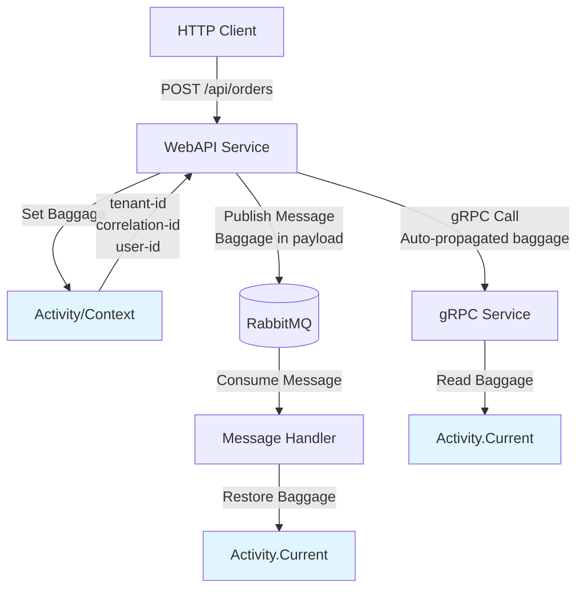
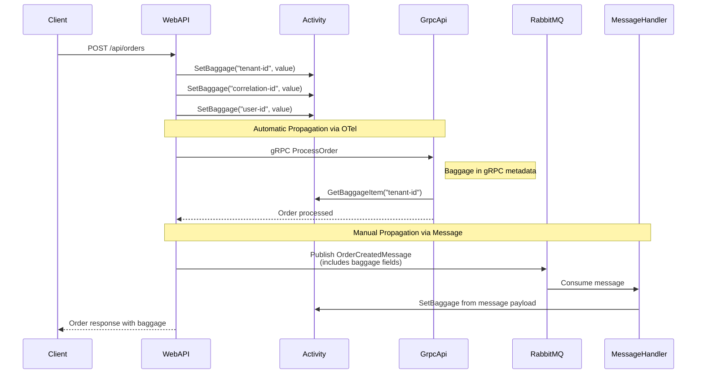

# Architecture Diagrams

## Service Communication Flow



## Baggage Propagation Mechanisms



## Component Structure

```
BaggageDemo Solution
│
├── BaggageDemo.AppHost (Aspire Orchestrator)
│   ├── Manages service lifecycle
│   ├── Configures RabbitMQ container
│   └── Sets up service discovery
│
├── BaggageDemo.WebApi (HTTP Entry Point)
│   ├── Creates orders
│   ├── SETS baggage in Activity
│   ├── Calls GrpcApi (auto-propagation)
│   └── Publishes to RabbitMQ (manual)
│
├── BaggageDemo.GrpcApi (gRPC Service)
│   ├── Processes orders
│   └── READS baggage (auto-received)
│
├── BaggageDemo.MessageHandler (Worker)
│   ├── Consumes RabbitMQ messages
│   └── EXTRACTS baggage from payload
│
├── BaggageDemo.ServiceDefaults (Shared Config)
│   ├── OpenTelemetry configuration
│   ├── Baggage propagation setup
│   └── Instrumentation configuration
│
└── BaggageDemo.Contracts (Shared Models)
    └── Message definitions
```

## Baggage Data Flow

```
┌─────────────────────────────────────────────────────┐
│ Baggage Items (Key-Value Pairs)                    │
├─────────────────────────────────────────────────────┤
│ • tenant-id: "tenant-acme-corp"                     │
│ • correlation-id: "a1b2c3d4-..."                    │
│ • user-id: "user-alice-123"                         │
└─────────────────────────────────────────────────────┘
                      ↓
        ┌─────────────────────────┐
        │  WebAPI sets in Activity │
        └─────────────────────────┘
                      ↓
        ┌─────────────┴─────────────┐
        ↓                           ↓
┌───────────────────┐    ┌──────────────────────┐
│ HTTP/gRPC Headers │    │ RabbitMQ Message     │
│ (automatic)       │    │ Payload (manual)     │
└────────┬──────────┘    └──────────┬───────────┘
         ↓                          ↓
┌─────────────────┐      ┌──────────────────────┐
│ GrpcApi reads   │      │ MessageHandler       │
│ from Activity   │      │ extracts & sets      │
└─────────────────┘      └──────────────────────┘
```

## Technology Stack

- **.NET 8**: Application framework
- **Aspire**: Orchestration and local development
- **OpenTelemetry**: Observability and baggage propagation
- **gRPC**: Inter-service communication
- **RabbitMQ**: Asynchronous messaging
- **ASP.NET Core**: Web API framework
